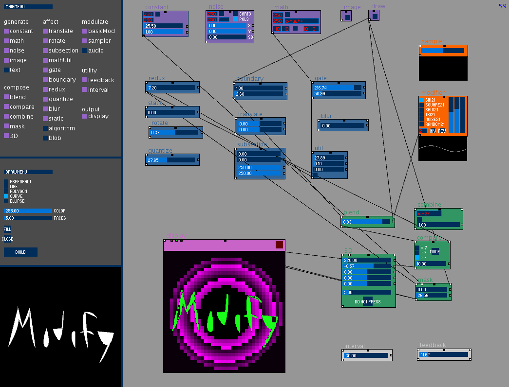
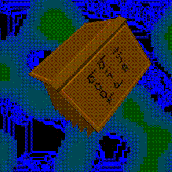
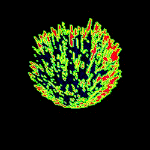
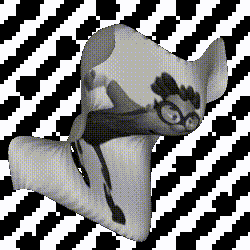
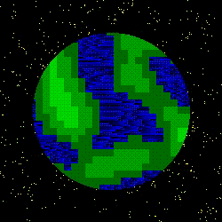
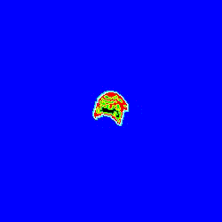

# modify
 
a modular image processor.
Animate in Processing. Good fun. 
  

 
*pixels, baby*
 
 

Modify is an image synthesizer. Its reciple is equal parts flexibility, discovery, and raw power. It will reward your curiousity and question your intentions. If you'd like instructions on how to play with it, continue reading :] 

 
*what has two wings and keeps worms up at night?*
 
 

<b>SETUP</b>

You will need to install [Processing](https://processing.org/download/) and make sure the ControlP5 library is properly installed. In the Processing IDE, find Sketch > Import Library > Add Library. Find ControlP5 and click buttons. After this, the PDE file should run without a hitch. Many thanks to Andreas Schlegel for his fabulous ControlP5 library, Kurt Spencer for his implementation of open simplex noise, and of course, all of the wonderful people who make and maintain Processing.

 
*slurp that pixel soup*
 
 

<b>GETTING STARTED</b>

The workflow is inspired by the programming language PureData. At the time of writing, the UI isn't thoroughly labelled. Start with these instructions. If there is anything you're unsure of/confused about, let me know!

See the menu in the top left. Add a noise module from under <b>generate</b> and a display module from <b>output</b>. Move the modules around the sketch by clicking and dragging the black grabber nodes at the top center. To Connect the output of the noise generator to the input of the display, first click the output of the noise module (small white square, bottom left). You should see a line originating at the ouput you clicked following your cursor position. The next input node you click on will form a connection. Click on the input node of the display module (small white square, top let) to see what noise looks like. 

Move the generator sliders around, have some fun.

 
*bloom*
 
 

Once you catch your breath, delete the connection by hovering the line between the modules (it should appear bold when hovered) and pressing the 'd' key. The connection is destroyed (to erase entire modules from existence, hover the grabber node and hit 'd', you monster). Go back to the menu, add a gate module from the <b>affect</b> column. Connect the noise generator output to the gate input, then connect the gate output to the display input. Move the sliders on the gate module around. Observe what they do. Feel the difference they make. Three modules become one. You are in control.

 
*I love this one. Makes me feel good*
 
 

Add a basicMod from the <b>modulate</b> section. What is it doing? Why is that red dot zipping around down there? Figure it out. Connect the modulation output on the basicMod (gray node, left side, under the red zero) to the modulation input on the noise generator (there are two of them on the right side). Hell, you could even connect it to both gray inputs. If you're a lunatic you could grab four basicMods and attach one to each of the two modifier inputs on the noise module and the gate module. Once you are pleased with your routing, discover the variety of basicMod by clicking buttons and moving sliders. This is the only way to learn.

 
*this is a serious application for serious people*
 
 

The general shape of a patch is as follows : Generate -> Affect/Combine -> Display. No module will yield any output if there isn't a generator of some variety upstream. Suggestion: start with a couple of noise generators, a constant generator, and a display. Try out each of the <b>combine</b> and <b>affect</b> modules. Chain several together. Have the end of a chain <b>combine</b> with an output from earlier in that same chain. Once you find an image you like, grab a <b>modulate</b> module and hook it up to different sliders in the patch. Adjust its amplitude and duration until you like what it's doing. To record, click the red square at the top right of the display module. Click again to stop recording. This will create a bunch of .tif files in the sketch folder. You can use Processing's Movie Maker tool to sequence these images.

 
*morph between surfaces using math generators, blend modules, and a 3D module. Example patches coming soon.*
 
 

<b>RULES</b>
- you must click an output before an input to form a connection
- you mustn't connect modulation nodes to data nodes or vice versa, but all like nodes are compatible
- you mustn't connect an output to its own input. Use the feedback module, smartypants.
- modules will not operate unless all data inputs and outputs have an active connection
- you must use reverse polish notation with the math module and the combine module. Examples given at the top of Expression.PDE
- you mustn't be upset if something doesn't work quite right / doesn't work at all (There are a handful of known bugs, but nothing distastrous)

 
*a pleasant, pulsing planet with strident, scrappy stars*
 
 

<b>COMING FEATURES :</b>

This tool is around 65% done. There are a few things that can make it more dynamic that I'm working on:

algorithm - a fairly general relational algorithm module. User defines relational conditions between neighboring pixels, as well as the action to perform given that those conditions are satisfied.

Blob - outputs a mask that locates shapes in its input. 

feedback - feedback module works ok right now, but you can't nest feedback modules, which is an important feature. May have to rethink how it's done.

audio input - seems like it wants to have an audio module as a modifier. Not sure exactly how I would want to implement that though.

Text/Draw - right now, the draw canvas is useful, but crude. I'd love to incorporate a solid vector based drawing window at some point in the future, with text, node editing tools, etc.

 
*spend some time putting trig into the 3D module*
 
 

<b>DOCUMENTATION :</b>

This section is not up to date, but definitely has some useful info. If you have a question about a specific module, check here. If you can't find the answer, contact me :)

<i>~ generators ~</i>

math - define an expression and the range over which to evaluate the expression using reverse polish notation (eg. x+y would be written xy+, and x^2+y^2 would be written x2^y2^+). The default, "xs", is sin(x). The two textfields that say 250 are the dimensions of the output. When you click the button to their right, they will update the dimensions of every module down the line, all the way to any connected display. Don't have two modules disagreeing on dimensions(I'll do an error message eventually). The boxes with -10 and 10 define the range over which to evaluate the expression, and the button sends the expression to the expression evaluator (although forming a connection will do this automatically). The expression evaluator maps the min and the max of the evaluation to 0 and 255.

noise - Generate an open simplex noise field. Polar or cartesian. Again, dimension boxes. The sliders define an increment on the x and y axis that are used to sample the noise in Cartesian mode. The box above the sliders is the noise seed. Use these text boxes to synchronize noise seeds if you'd like. By default a new seed is generated with every module that uses noise (right now, just noise and basicMod).

image - Hit the button and use the file select screen to navigate to an image (just jpg works I think). All connected modules should resize accordingly, there might be some bugs with resizing. Will tackle them soon.

draw - will be for drawing masks (full black and white, no gray scale, just 0 and 255.. yin and yang, off and on, yes and no, no ifs ands or 127s). This will be useful for more concrete animation sequences. Will make evoking specific forms much easier

text - Again, map text to a mask, maybe a scroll list with different fonts

<i>~ functions ~</i>

compare - two modes. Mask mode, and either/or mode. In mask mode, the output of the pixel is white if the equality/inequality condition is met (read left input, condition, right input), and black otherwise. In either/or mode, the vaule of the left input is pushed through if the condition is met, and the right input otherwise. The slider is a threshold for when you are set to = mode. It corresponds to how close the inputs need to be for the condition to be met.

combine - Expression evaluator again. This time two data inputs. The left input is 'x' and the right is 'y'. The default is "xy+2/", which will give the average of the two inputs. I'll soon list more instruction on how to use the expression evaluator.

gate - If the pixel value is above the top slider value, push that pixel to white. If it is below the bottom slider value, push it to black. Otherwise, leave it the same.

boundary - simple edge detector. Useful in conjunction with gate to draw an outline of a shape. Top slider is the threshold for the difference between neighboring pixels that constitutes a boundary. Bottom is the thickness of the boundary line being drawn. Outputs a mask.

mask - A way to combine to images. Right input is a mask, typically (but not necessarily) black and white. The sliders correspond to the target and tolerance applied to the mask. for each pixel in the mask that satisfies the target/tolerance, push the value of the left input through. For each pixel that doesn't satisfy, push the right pixel through.

util - Utility for (in descending order) multiplying by a constant, multiplying by a small teeny constant, adding a constant, and inverting an image.

redux - pixellate

<i>~ modifiers ~</i>

basicMod - amplitude, duration, and quantization of the modifier data array. Invert and reverse the array with the buttons. Change the noise seed with the text field. six different standard envelope types

sampler - Generate a modifier envelope with the first row of an image input. Use this with a math generator to get custom defined modifier envelopes

<i>~ output ~</i>

display - does the damn thing. Takes the data input (values from 0 to 255), and generates a grayscale image. Will soon have RGB channels that override.
